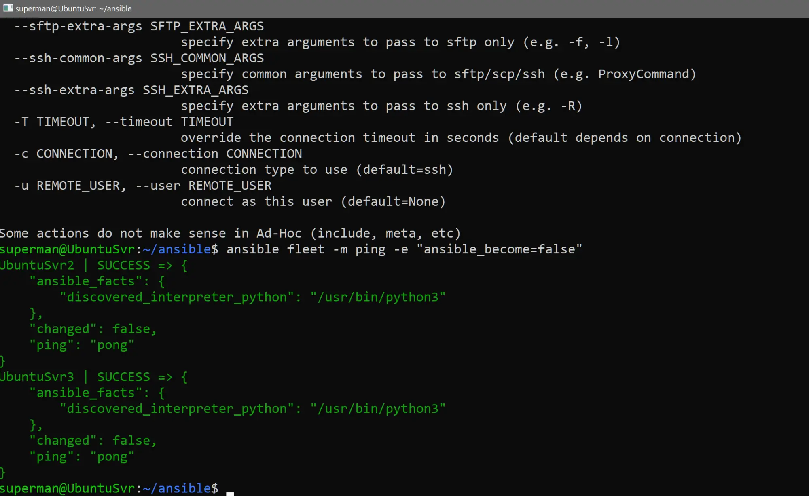
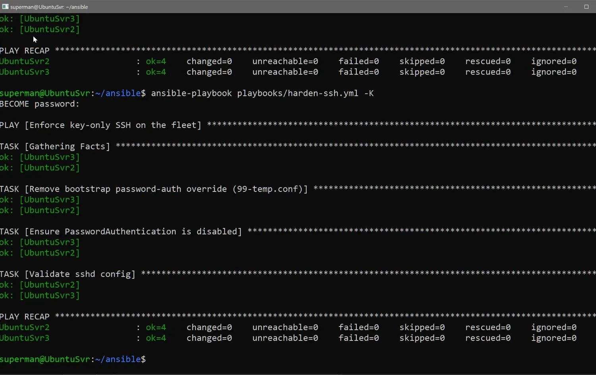
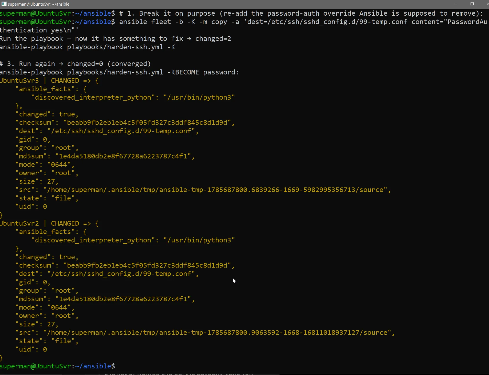
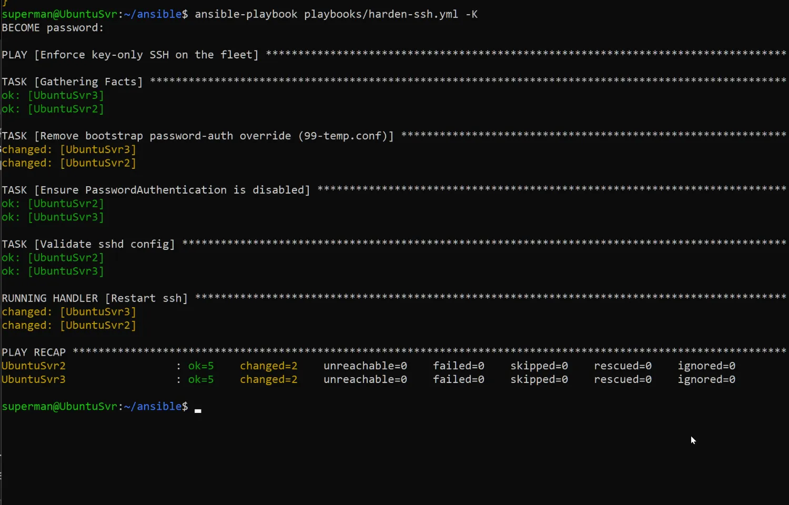
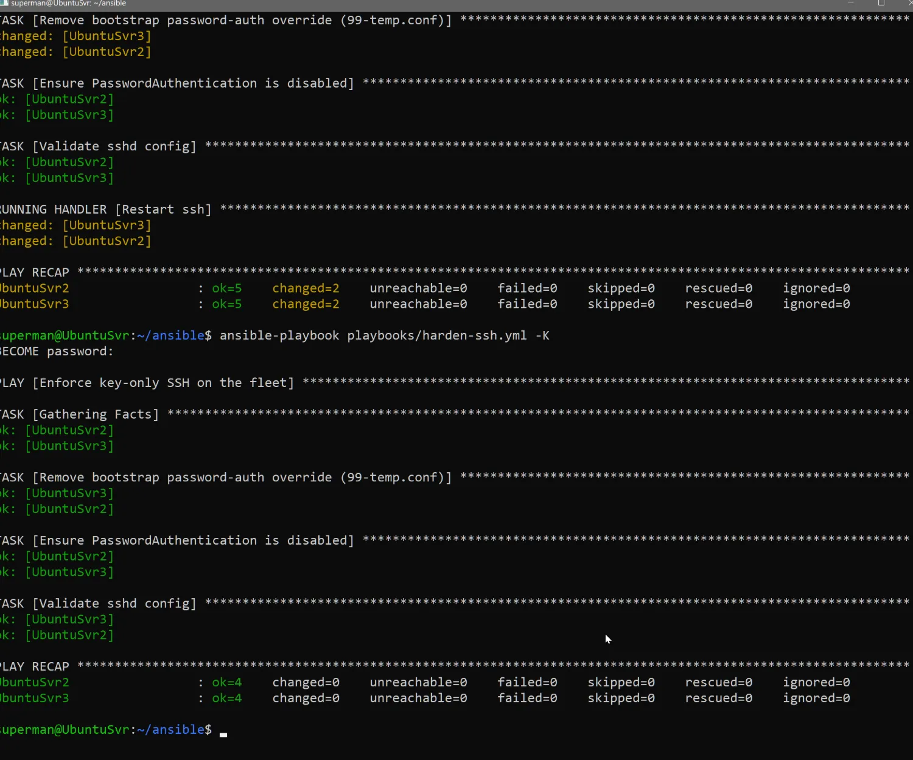

# Ansible — Fleet SSH Hardening (idempotency + handlers)

Configuration management across a Linux fleet with Ansible: enforce **key-only SSH** on the managed
nodes, and demonstrate the two properties that make Ansible safe at scale — **idempotency** and
**event-driven handlers**.

## Layout
- `ansible.cfg` — config (inventory path, `become = True` via sudo)
- `inventory.ini` — the `[fleet]` group: `UbuntuSvr2` (192.168.1.115), `UbuntuSvr3` (192.168.1.116); user `superman`, key auth
- `playbooks/harden-ssh.yml` — the play: remove the bootstrap password-auth override, enforce
  `PasswordAuthentication no`, validate `sshd -t`, and **restart ssh via a handler only if something changed**
- Control node: `UbuntuSvr` (192.168.1.114)

## Plain-English cheat sheet
| Command | What it does |
|---|---|
| `ansible fleet -m ping` | "Servers, you alive?" → `pong` |
| `ansible-playbook playbooks/harden-ssh.yml -K` | Run the to-do list; `-K` asks for the sudo password |
| `-b` / `--become` | Use sudo (become root) |
| `-e "ansible_become=false"` | Don't sudo for this one (used for ping) |

---

## 1. Connectivity (ad-hoc)
```bash
ansible fleet -m ping -e "ansible_become=false"
```
Both nodes return `SUCCESS` / `"ping": "pong"`.


## 2. Idempotency — first run (already converged)
```bash
ansible-playbook playbooks/harden-ssh.yml -K
```
The fleet was already hardened, so the playbook checks everything and changes nothing:
`ok=4, changed=0` on both nodes. Running it repeatedly is safe.


## 3. Inject drift (to demonstrate correction)
Re-add the password-auth override the playbook is supposed to remove:
```bash
ansible fleet -b -K -m copy -a 'dest=/etc/ssh/sshd_config.d/99-temp.conf content="PasswordAuthentication yes\n"'
```
Both nodes: `changed: true` — the drift file is back.


## 4. The playbook corrects the drift — and the handler fires
```bash
ansible-playbook playbooks/harden-ssh.yml -K
```
`ok=5, changed=2`: it removed the override and re-asserted hardening. Because the config **changed**,
the `notify` triggered **`RUNNING HANDLER [Restart ssh]`** — ssh was restarted.


## 5. Re-run — converged, and the handler does NOT fire
```bash
ansible-playbook playbooks/harden-ssh.yml -K
```
`ok=4, changed=0`: nothing to fix. Note there is **no `RUNNING HANDLER` section** — because nothing
changed, the handler didn't run. ssh is not restarted for no reason.


---

## What this demonstrates
- **Idempotency:** declare desired state; Ansible only acts when reality doesn't match. `changed=2 → changed=0`.
- **Handlers are event-driven:** `notify` runs the ssh-restart handler **only when a task actually changed**
  something — so services aren't bounced on every run, only when their config really changed.
- **Privilege escalation:** `become` (sudo). If the automation user's sudo needs a password, pass `-K`
  (`--ask-become-pass`); a "Missing sudo password" error is just `become` hitting a sudo prompt.
- **Ad-hoc vs playbook:** `ansible ... -m ping` is a one-off command; `ansible-playbook` runs a versioned,
  repeatable YAML — the same desired state, every time.

**Config-management context:** this is how Linux *servers* are managed (vs. UEM/Intune for end-user
endpoints, and GPO/ADMX for Windows) — same "desired state" discipline, different tool per platform.
