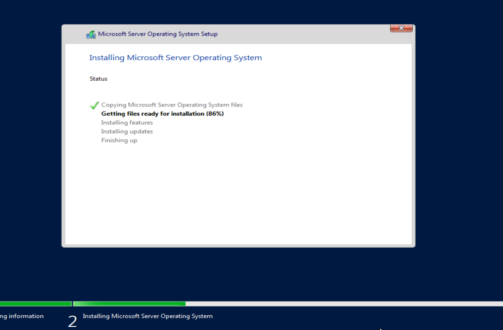
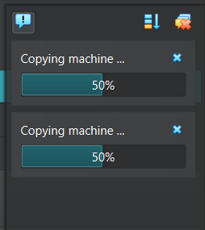
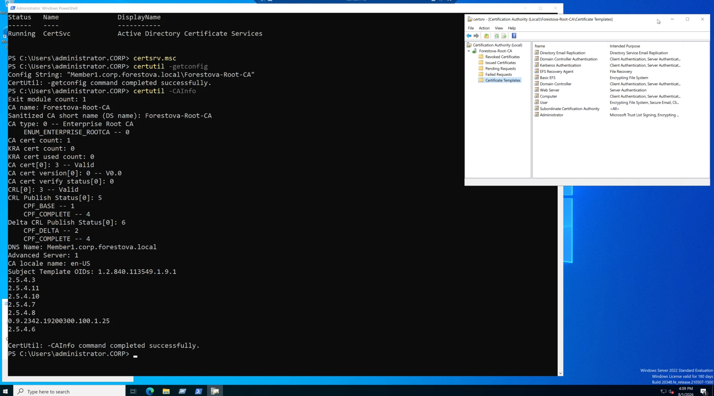
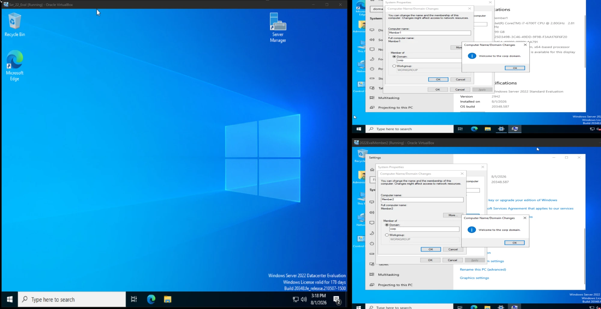
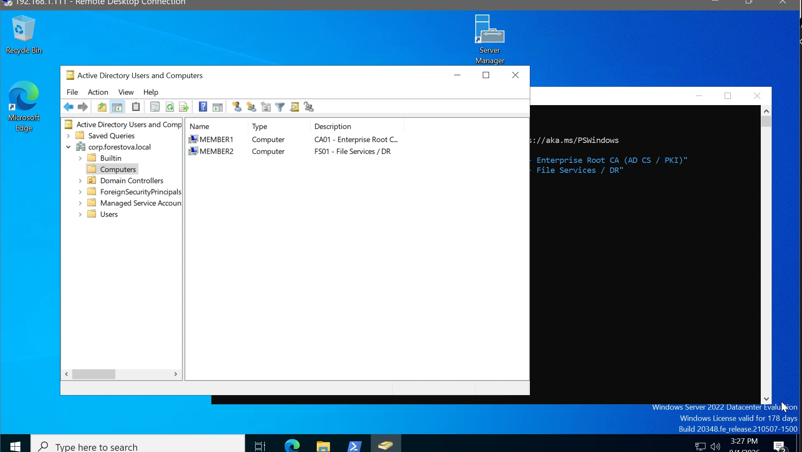
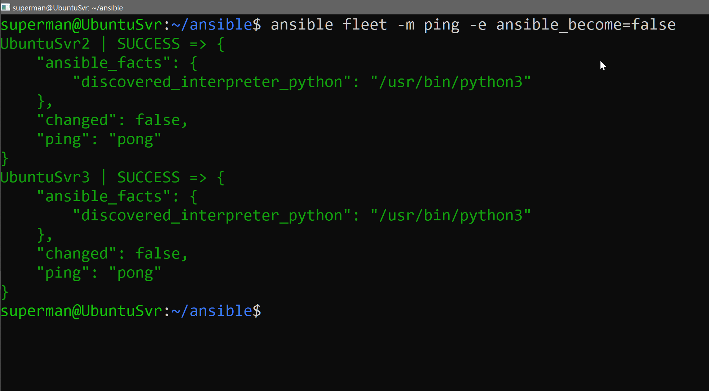
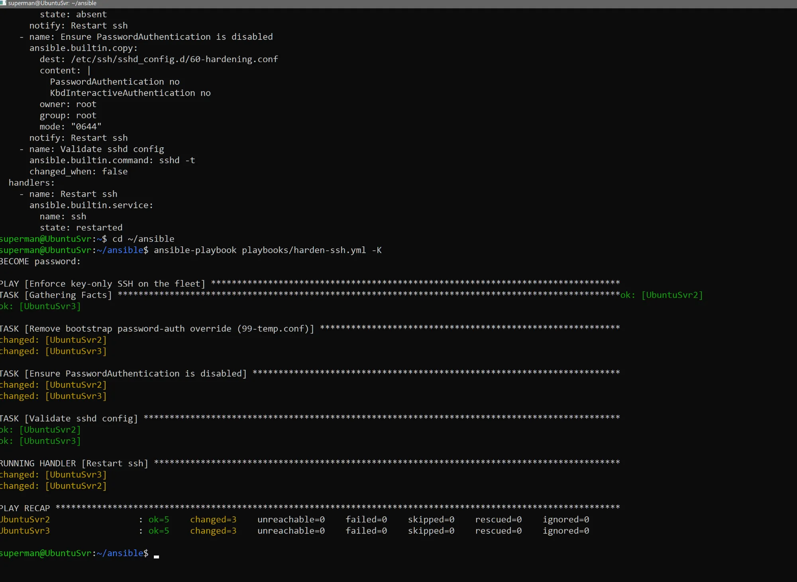
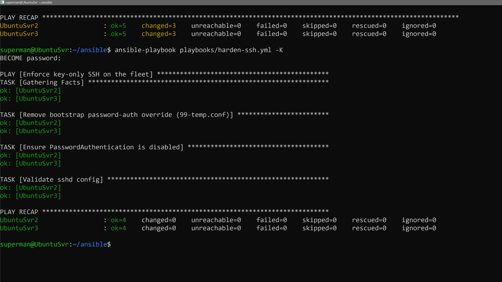

# Build Log & Artifacts

Running log of what was built, in order, with screenshots. Drop images into `images/` and
reference them here.

---

## 1. Windows Server 2022 member servers

- Created two Server 2022 eval VMs in VirtualBox (`CA01` = Standard, `DC02`/`FS01` = Datacenter)
  to expose both editions.
- **Gotcha logged:** VirtualBox *Unattended Install* failed with
  *"Windows cannot find the Microsoft Software License Terms"* — a known VirtualBox bug with
  multi-edition Server ISOs, **not** ISO corruption. **Fix:** recreate VM with
  **"Skip Unattended Installation"** checked → manual Setup installs cleanly.
- Post-install sequence: static IP → **Preferred DNS = DC (192.168.1.111)** → rename → snapshot
  (workgroup base) → domain join → snapshot again.


*Server 2022 installing cleanly via manual Setup (unattended skipped).*

## 2. Linux fleet via cloning

- Control node = golden image **`UbuntuSvr`** (keeps its name; carries the baked-in SSH key).
- Cloned `UbuntuSvr` (Full Clone + new MACs) into fleet nodes `UbuntuSvr2` / `UbuntuSvr3` / …

### Identity reset per clone — the Linux equivalent of Windows sysprep/SID

A clone is a byte-for-byte copy, so it inherits the golden image's hostname, machine-id, dbus-id,
and SSH host keys. Left unchanged, the clones are colliding twins on the network. Run on **each**
clone, then reboot:

```bash
sudo hostnamectl set-hostname UbuntuSvr2                        # 1. unique name
sudo truncate -s 0 /etc/machine-id                             # 2. blank machine-id → regenerated on boot
sudo rm -f /var/lib/dbus/machine-id && sudo dbus-uuidgen --ensure   # 3. dbus's copy of machine-id
sudo rm -f /etc/ssh/ssh_host_* && sudo dpkg-reconfigure openssh-server  # 4. fresh SSH host keys
sudo reboot                                                    # 5. regenerate + apply
```

| Step | What it fixes | Why it matters |
|------|---------------|----------------|
| `hostnamectl set-hostname` | duplicate hostname | clones all report `UbuntuSvr` until renamed |
| blank `/etc/machine-id` | duplicate machine identity | DHCP keys off machine-id → clones fight over the same IP |
| dbus machine-id | duplicate D-Bus host identity | D-Bus (local IPC bus) uses machine-id to identify the host |
| regenerate `ssh_host_*` | shared SSH host keys | Ansible flags identical keys as impersonation; also a security hole |

- **On the `dpkg-reconfigure` prompt** (sshd_config locally modified): choose **"keep the local version
  currently installed"** — the golden image is hardened, so its `sshd_config` must be preserved, not
  overwritten with the stock default.
- Passwordless SSH keys carried over from the image → Ansible reaches the fleet with zero setup.

### Gotcha logged
- Cloning the **hardened** golden image proved fragile: the first clones wedged on boot with
  `rcu_preempt` stalls + `blocked for 122 seconds` hung tasks (heavy auditd ruleset load under host
  CPU oversubscription from booting the whole farm at once). **Fix:** boot clones one at a time,
  cap each at 2 vCPUs. Fresh clones boot clean solo.

### Static addressing
- Fleet pinned to static IPs via netplan, DNS pointed at the DC so Linux nodes resolve
  `corp.forestova.local` (incl. the CA): Windows `.111`–`.113`, Linux `.114`–`.116`.


*Full-cloning the Ubuntu golden image into Ansible target nodes (new MACs generated).*

### Story beat: "the friction *is* the hardening working"

Setting up SSH between the control node and the fleet was unexpectedly sticky — every connection,
even from the control node itself, returned `Permission denied (publickey)` with no password prompt.
The instinct was "something's broken." It wasn't. **The golden image was hardened with an Ansible
CIS/STIG-style playbook**, which had (correctly):

- set `PasswordAuthentication no` → **key-only login** (no password prompt is offered — that's the
  `publickey` denial), and
- enabled `ufw` and other lockdowns.

A hardened server that let you password-SSH from anywhere would be a *failure* of the hardening — so
the friction was proof the hardening does its job. The real gap was smaller than it looked: the
image was key-only, but **no key trust had ever been distributed** — the golden image never trusted
itself, so no clone trusted the control node. One-time fix: temporarily re-enable password auth on
each target (`/etc/ssh/sshd_config.d/99-temp.conf`), `ssh-copy-id` the control node's key, then
remove the temp file to re-harden.

Two things that looked like the same event but weren't:
- **"the clone booted"** = it reached a login prompt (the earlier RCU-stall fight was about *boot*,
  i.e. CPU oversubscription).
- **"the clone trusts my SSH key"** = a separate layer entirely. Booting fine says nothing about key
  trust. Both were true at once, which is what made it briefly confusing.

**Takeaway for the writeup:** hardening changes the *provisioning workflow* (you exchange keys instead
of passwords), and understanding that distinction — hardening as designed vs. a misconfiguration — is
the actual skill.

## 3. Networking — isolated lab network

- Chose **Host-Only / Internal Network** for the entire farm over NAT or Bridged.
- **Reasoning logged:** the DC runs DHCP/DNS. On **Bridged** that DHCP would collide with the home
  router's DHCP (two servers handing out leases on the same LAN). Plain **NAT** isolates each VM so
  they can't see each other — no domain, no Ansible. **Host-Only/Internal** gives an isolated switch
  where the DC cleanly owns `192.168.1.0/24`.
- **Gotcha logged:** Host-Only/Internal has **no internet in guests** by default. For boxes needing
  updates, add a **second adapter (NAT)** — Adapter 1 = Host-Only (domain), Adapter 2 = NAT (internet).
- **Uniformity rule:** all machines (DC, CA01, FS01, Ubuntu fleet) must share the same network type
  or they can't communicate. DNS on every member points at the DC (`192.168.1.111`).
- **Gotcha logged:** cold-booting the whole farm (3 Win + 3 Linux) at once oversubscribes host CPU →
  `rcu_preempt` stalls + `blocked for more than 122 seconds` hung tasks on the hardened Ubuntu nodes
  (heavy auditd ruleset load with no spare CPU). **Fix:** boot VMs one at a time; cap each VM at 2 vCPUs.

## 4. PKI (AD CS) — Enterprise Root CA

- Installed AD CS on a member server (`Member1`, `192.168.1.112`) and configured it as an
  **Enterprise Root CA** entirely via PowerShell (no wizard) — the same commands work headless on
  Server Core:
  ```powershell
  Install-WindowsFeature ADCS-Cert-Authority -IncludeManagementTools
  Install-AdcsCertificationAuthority -CAType EnterpriseRootCA -CACommonName "Forestova-Root-CA" -Confirm:$false
  ```
- Verified operational, not just installed:
  ```powershell
  Get-Service CertSvc          # Running
  certutil -CAInfo             # CA type 0 (Enterprise Root), CA cert Valid, CRL Valid
  ```
- **Enterprise CA = AD-integrated**: the root cert auto-publishes to every domain member's trust
  store, and templates (Computer, User, Web Server, Kerberos Auth, …) are published in the directory.
- **Naming note logged:** the join/CA dialogs show the NetBIOS short name (`corp`) while the real
  domain is `corp.forestova.local` — the FQDN is what everything actually uses.
- **Design choice logged:** kept generic hostnames (`Member1`/`Member2`) and encoded roles as **AD
  computer-object descriptions** (`CA01 - Enterprise Root CA`, `FS01 - File Services / DR`) —
  centrally queryable via `Get-ADComputer -Properties Description`, no rename churn.


*`certutil -CAInfo` + the CA console: `Forestova-Root-CA` running, CA type 0 (Enterprise Root), CA cert
and CRL valid, templates published — operational, not just installed.*


*Both member servers joined the domain — "Welcome to the corp domain."*


*Roles encoded as AD computer-object descriptions (centrally queryable) instead of renaming hostnames —
managed over RDP to the DC.*

## 5. Ansible fleet — control node + idempotent hardening

The payoff: one Ansible **control node** (`UbuntuSvr`, `192.168.1.114`) managing the cloned fleet
(`UbuntuSvr2` `.115`, `UbuntuSvr3` `.116`) over key-based SSH.

### Inventory (`ansible/inventory.ini`)
```ini
[fleet]
UbuntuSvr2 ansible_host=192.168.1.115
UbuntuSvr3 ansible_host=192.168.1.116

[fleet:vars]
ansible_user=superman
ansible_ssh_private_key_file=~/.ssh/id_ed25519
```
The `[fleet]` group lets one command act on every node: `ansible fleet -m ping` → both return `pong`.

### The idempotency demo (`ansible/playbooks/harden-ssh.yml`)
The bootstrap step temporarily re-enabled password auth to distribute keys (see §2). This playbook
undoes that and enforces **key-only SSH** as the desired state — and demonstrates the two concepts
that matter most:

- **Run 1:** `changed=3`, and `RUNNING HANDLER [Restart ssh]` fires — ssh restarts **only because a
  task changed** and `notify`'d the handler.
- **Run 2 (identical command):** `changed=0`, **no handler section** (`ok` drops 5→4 because the
  handler is no longer even counted). Reality already matches desired state → safe no-op.

> **Why it matters:** Ansible is desired-state, not a script. First run converges the fleet to
> key-only SSH; second run makes zero changes because nothing drifted. That's idempotency plus
> notify/handler mechanics — safe to run a thousand times.

- **Privilege escalation:** `superman` uses `sudo` with `-K` (`--ask-become-pass`) for interactive
  runs; the fully-unattended pattern is key-only SSH + `NOPASSWD` sudo (no password anywhere, trust
  held in the key).


*`ansible fleet -m ping` → both nodes `SUCCESS` / `pong`: the control node reaches the entire fleet over
key-based SSH. The fleet is alive.*


*Run 1: `changed=3`, and `RUNNING HANDLER [Restart ssh]` fires — ssh restarts only because a task changed.*


*The same playbook run twice: `changed=3` → `changed=0`, handler silent the second time (`ok` drops 5→4).
Desired-state config, not a script — safe to run a thousand times.*

### Ops scripts (`scripts/`)
- `fleet-up.ps1` — boots the DC then the 3 Ubuntu nodes **headless** (managed entirely over SSH).
- `fleet-down.ps1` — graceful ACPI shutdown, fleet first then DC last.

## 6. PKI in action — issue & harden a TLS cert (Windows CA → IIS)

Built on §4's Enterprise Root CA: issued a real **Web Server TLS certificate** from `Forestova-Root-CA`,
bound it to **IIS** on `DC01`, hit the classic **"Not secure" / missing-SAN** failure, diagnosed it
(enrollment context + browsers validating the **SAN** not the CN), and re-issued **with a SAN via
`certreq`** → green padlock, trusted domain-wide (verified from member `.112`).

→ Full write-up + screenshots: [`windows/pki/`](../windows/pki/README.md)

## 7. Group Policy — CIS-aligned Chrome hardening via ADMX

Loaded the **Chrome ADMX** into the domain **Central Store** (SYSVOL), authored a GPO
(`Chrome-Hardening-CIS`: block all extensions, enhanced Safe Browsing, disable incognito + browser
password saving), targeted it via a **`LabServers` OU**, and validated end-to-end on member `.113`
(registry + `chrome://policy`) — including catching and fixing a **blocklist-vs-allowlist** misconfig.
Includes a **standalone `.reg`** equivalent (same settings, no domain).

→ Full write-up + screenshots: [`windows/gpo/`](../windows/gpo/README.md) · [`windows/gpo/standalone-reg/`](../windows/gpo/standalone-reg/README.md)

## 8. Ansible — idempotency + handler demo (re-run 2026-08-02)

Re-demonstrated the fleet SSH-hardening play with a clean **drift → correct → converge** arc
(`changed=2 → changed=0`) and proved the ssh-restart **handler fires only on change**.

→ Full write-up + screenshots: [`ansible/`](../ansible/README.md)

## 9. Intune MDM PoC (UEM / mobile device management) — in progress

Stood up a **Microsoft Intune** trial tenant (`ofear.onmicrosoft.com`), confirmed **MDM authority =
Microsoft Intune**, licensed the admin, and authored an Android **compliance policy** +
**configuration profile**. **Device enrollment pending** (Managed Google Play hit Google's temporary
anti-abuse throttle — retry).

→ Write-up + screenshots: [`windows/intune/`](../windows/intune/README.md)
