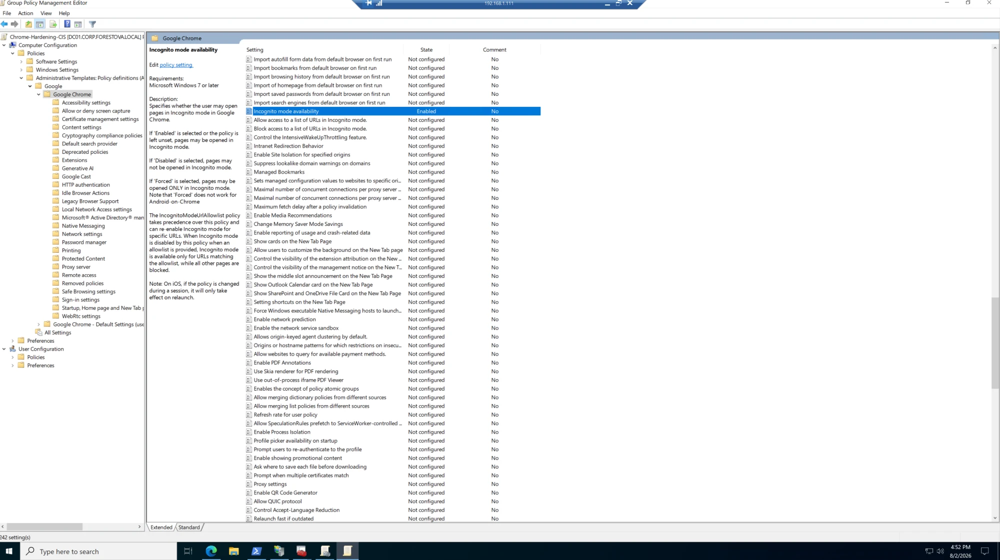
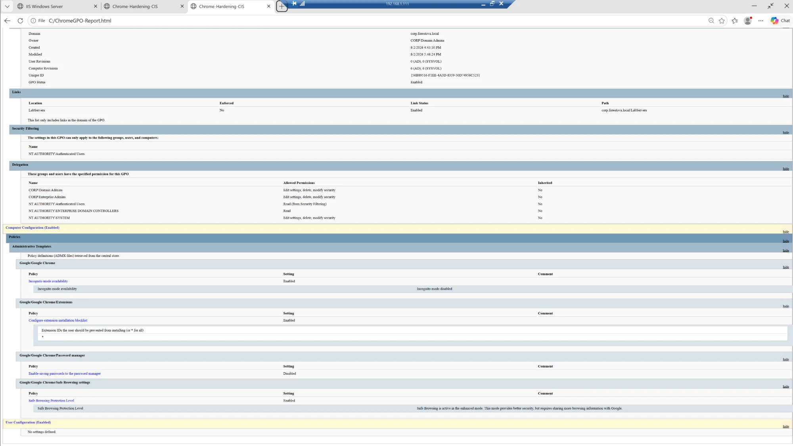
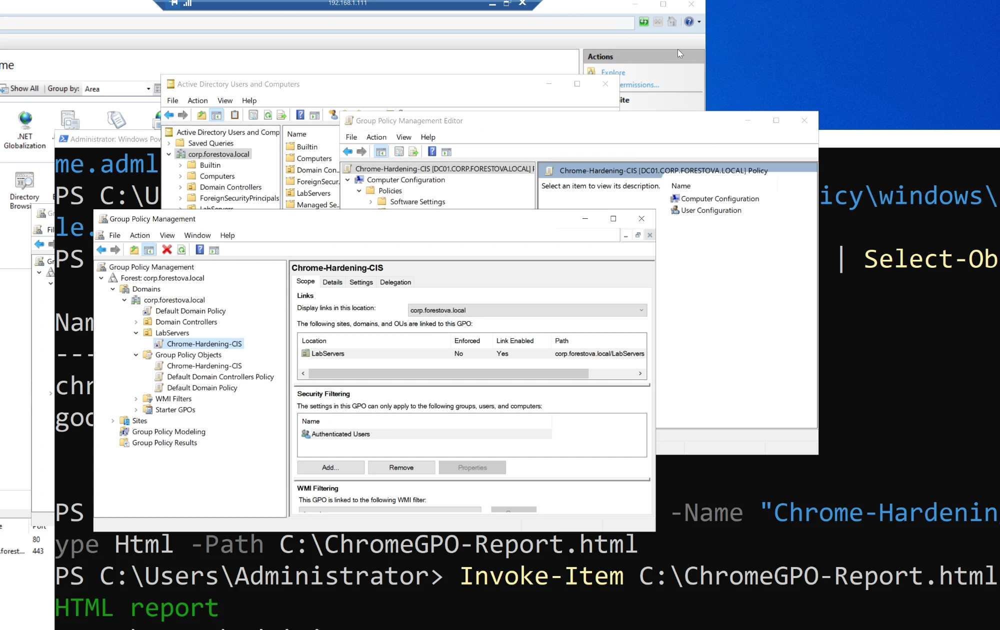
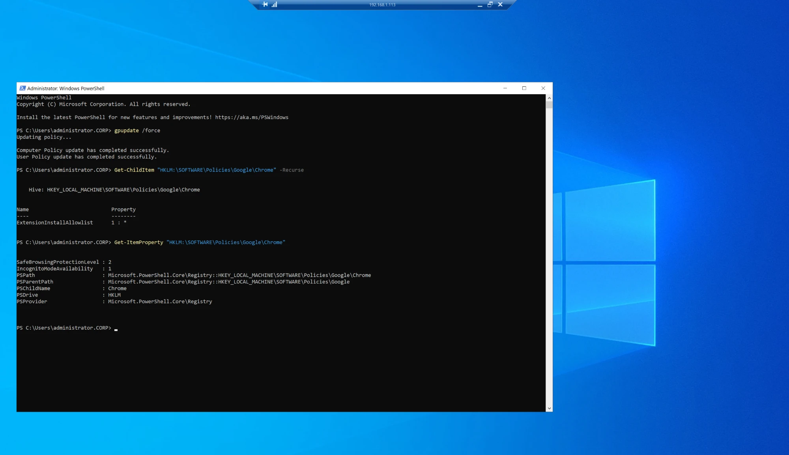
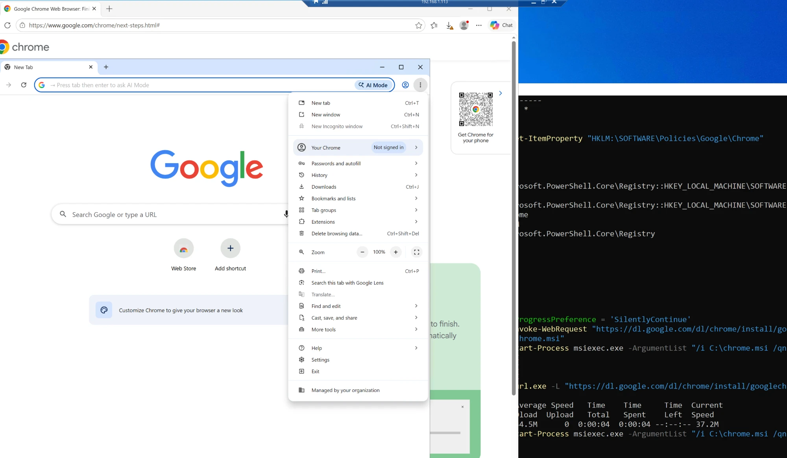
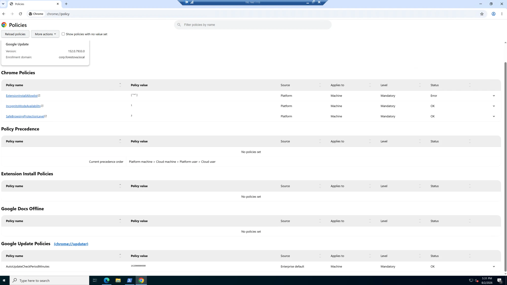

# Group Policy — CIS-Aligned Chrome Hardening via ADMX

Push CIS-aligned Google Chrome hardening to a targeted OU using the Chrome ADMX templates in the
domain **Central Store**, then validate end-to-end on a member server — including catching and
correcting a blocklist-vs-allowlist misconfiguration during verification.

## Environment
- **DC01** (`192.168.1.111`) — AD DS, DNS, GPMC, ADMX Central Store
- **MEMBER2 / FS01** (`192.168.1.113`) — target member server (moved into the `LabServers` OU)
- Domain: `corp.forestova.local`

## The chain (what each piece does)
**CIS Benchmark** (what to harden) → **Chrome ADMX** from Google (gives Group Policy the ability to set it) → **Central Store** in SYSVOL (makes the ADMX available domain-wide) → **GPO linked to an OU** (applies it to the target).

---

## 1. Load the Chrome ADMX into the domain Central Store
The Central Store is a SYSVOL folder replicated to all DCs — one authoritative copy of the templates.
```powershell
# Download Google's official Chrome policy templates
curl.exe -L "https://dl.google.com/dl/edgedl/chrome/policy/policy_templates.zip" -o C:\chrome_policy.zip
Expand-Archive C:\chrome_policy.zip -DestinationPath C:\chrome_policy -Force

# Copy Chrome + Google ADMX/ADML into the Central Store
$cs = "C:\Windows\SYSVOL\domain\Policies\PolicyDefinitions"
New-Item -ItemType Directory -Force -Path $cs, "$cs\en-US" | Out-Null
Copy-Item C:\chrome_policy\windows\admx\chrome.admx  $cs -Force
Copy-Item C:\chrome_policy\windows\admx\google.admx  $cs -Force
Copy-Item C:\chrome_policy\windows\admx\en-US\chrome.adml "$cs\en-US" -Force
Copy-Item C:\chrome_policy\windows\admx\en-US\google.adml "$cs\en-US" -Force
```
GPMC now shows the Chrome settings, sourced from the Central Store (see the GPO report note:
*"Policy definitions (ADMX files) retrieved from the central store"*).

## 2. Create + configure the GPO
`Chrome-Hardening-CIS` — Computer Configuration → Policies → Administrative Templates → Google → Google Chrome:

| Setting | Value | Why |
|---|---|---|
| Incognito mode availability | **Disabled** | no unmonitored browsing |
| Safe Browsing Protection Level | **Enhanced** | real-time phishing/malware blocking |
| Extensions → **Configure extension installation blocklist** | **`*`** | block ALL extensions by default (top wallet-drain / supply-chain vector) |
| Password manager → Enable saving passwords | **Disabled** | force a real password manager, not the browser |




## 3. Target it — OU + link
Member servers live in the default `Computers` container, which **cannot** have GPOs linked to it.
So: created a `LabServers` OU (root of the domain), moved `MEMBER2` into it (ADUC), and linked the GPO
to the OU (GPMC → right-click OU → *Link an Existing GPO*).


> **Container vs OU:** you can only link GPOs to the domain, sites, and OUs — never the default
> Computers/Users containers. Objects there receive only domain/site-level GPOs; targeted policy
> requires moving them into an OU.

## 4. Apply + validate on the target (MEMBER2 / .113)
```powershell
gpupdate /force
Get-ChildItem "HKLM:\SOFTWARE\Policies\Google\Chrome" -Recurse
Get-ItemProperty "HKLM:\SOFTWARE\Policies\Google\Chrome"
```


Installed Chrome and checked `chrome://policy` — the browser reports the policies as
Source **Platform**, applied for the enrollment domain `corp.forestova.local`. Incognito is disabled
and Chrome shows **"Managed by your organization."**


## 5. The bug validation caught (and the fix)
First pass, `chrome://policy` flagged **Status: Error** on the extension policy. Root cause: the
**allowlist** had been set to `*` — which *exempts* all extensions from blocking (the opposite of
hardening), and `*` is invalid in an allowlist (it expects specific extension IDs).


**Fix:** set the extension **allowlist** back to Not Configured and the **blocklist** to `*`
(block all by default). Re-verified: all four policies apply cleanly.

---

## What this demonstrates
- Group Policy at scale via the **ADMX Central Store** (SYSVOL-replicated)
- OU-based GPO targeting; **container vs OU** distinction
- CIS-aligned browser hardening (extensions, Safe Browsing, incognito, password manager)
- **Endpoint validation discipline** — registry + `chrome://policy` + `gpresult`, catching and
  correcting a real misconfiguration rather than assuming the settings were right
