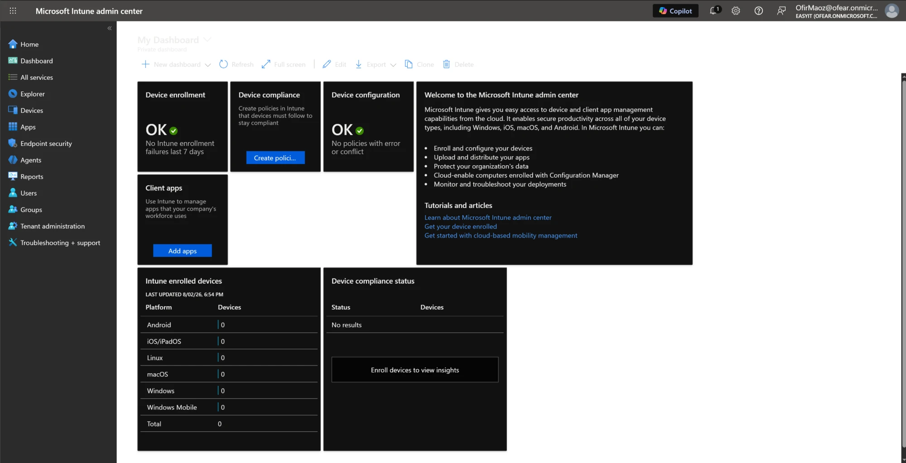
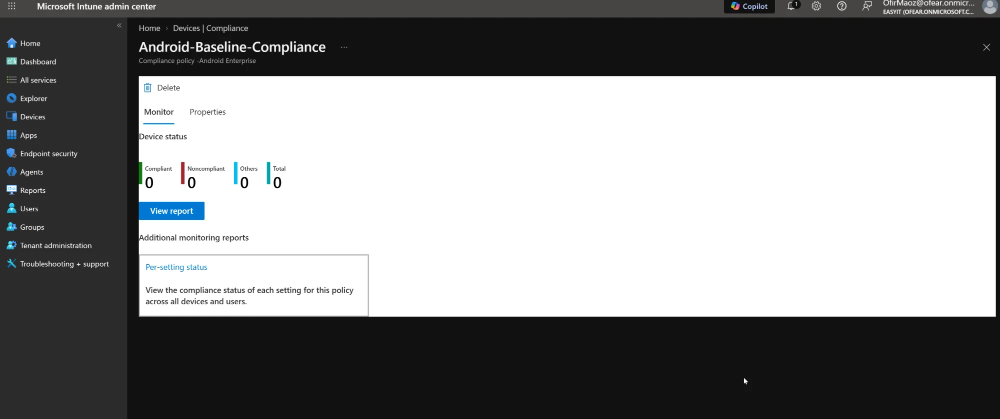

# Intune MDM — Tenant Setup & Policy Authoring (PoC)

Standing up Microsoft Intune (UEM/MDM) and authoring device compliance + configuration policies for
Android endpoints. Companion to the on-prem AD work in this repo — this is the **cloud endpoint
management** side.

> **Status — in progress.** Tenant is live and policies are authored. Device *enrollment* is the
> remaining step (the Managed Google Play connection hit Google's temporary anti-abuse throttle and
> will be completed on retry). This folder documents the configuration authored so far; enrollment +
> a compliant device will be added when the Google connection succeeds.

## Environment
- **Tenant:** Microsoft Intune Plan 1 trial (Entra ID + Intune), `ofear.onmicrosoft.com`
- **MDM authority:** Microsoft Intune (default)
- **MFA:** enforced on admin sign-in (Microsoft Authenticator)

## Done
1. **Created the Intune tenant** via the Intune Plan 1 trial; assigned an Intune license to the admin user.
2. **Confirmed MDM authority = Microsoft Intune** (Tenant administration → Tenant status).
3. **Authored an Android compliance policy** — `Android-Baseline-Compliance` (Android Enterprise):
   - Block rooted devices
   - Require a device password/screen lock
   - Minimum OS version
   - Require storage encryption
   - Assigned to all users.
4. **Authored an Android configuration profile** — `Android-Work-Restrictions` (personally-owned work
   profile): block screen capture, block copy/paste between work and personal profiles, minimum
   password length.

## Pending
- **Connect Managed Google Play** (Android Enterprise binding) — blocked by Google's temporary
  "unusual activity" throttle; retry.
- **Enrol the drawer Android** via the Company Portal app (work profile).
- **Verify on device + in console:** work profile present, restrictions enforced (screenshot blocked,
  copy/paste blocked), device shows **Compliant** and config profile **Succeeded** in the admin center.

## MDM concepts demonstrated / talking points
- **UEM vs. servers:** Intune/UEM manages end-user endpoints (mobile, tablet, laptop, any OS) — **not**
  servers; Linux servers are config-managed with Ansible. Different tools, different jobs.
- **MFA vs. enrollment:** MFA verifies the *user's identity*; enrollment brings the *device* under
  management. Separate layers.
- **Compliance vs. configuration:** a compliance policy defines what makes a device "healthy"; a
  configuration profile pushes the actual settings/restrictions.
- **Bridge to MaaS360:** same UEM model — directory integration, compliance and
  configuration policies, conditional access — implemented here on the Microsoft stack.
