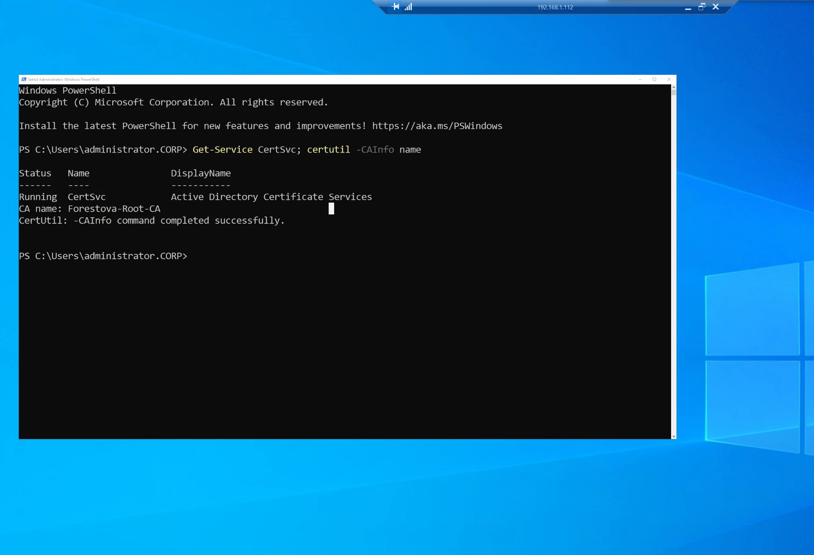
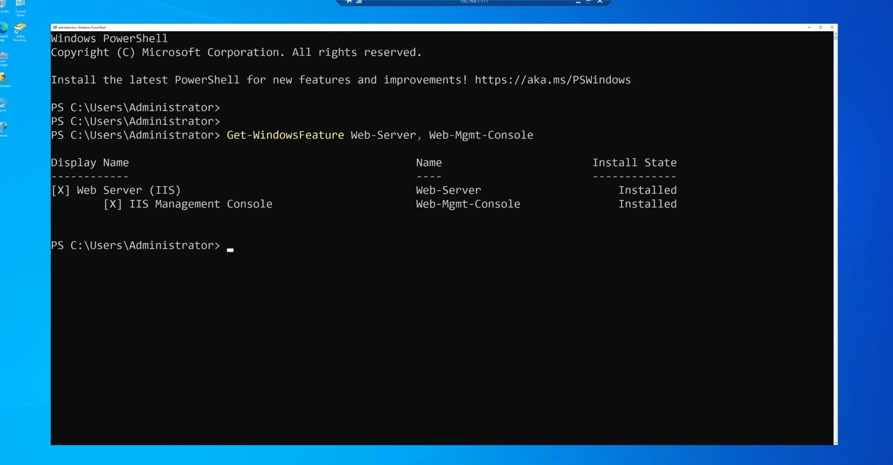
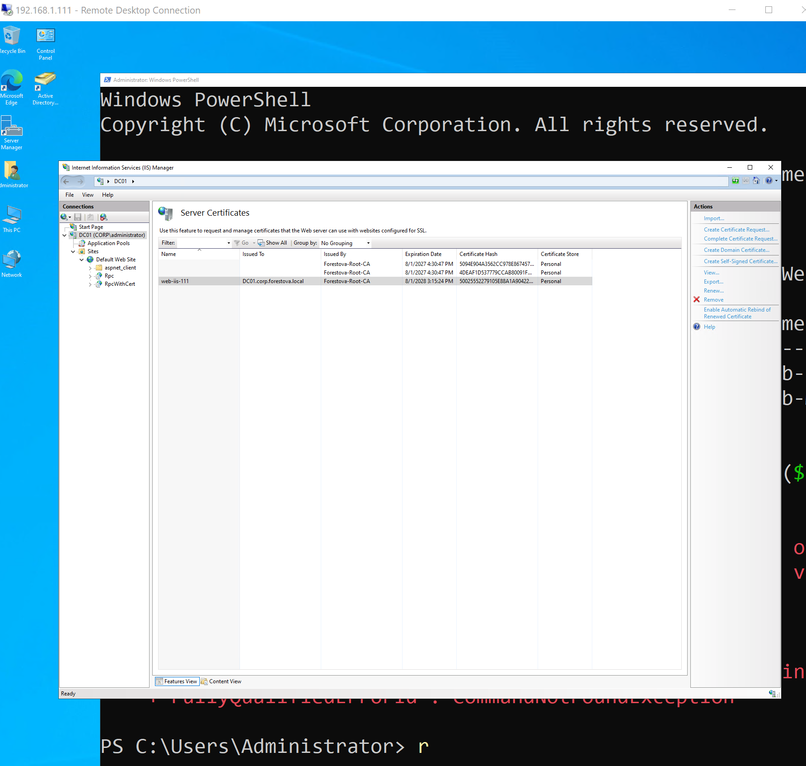
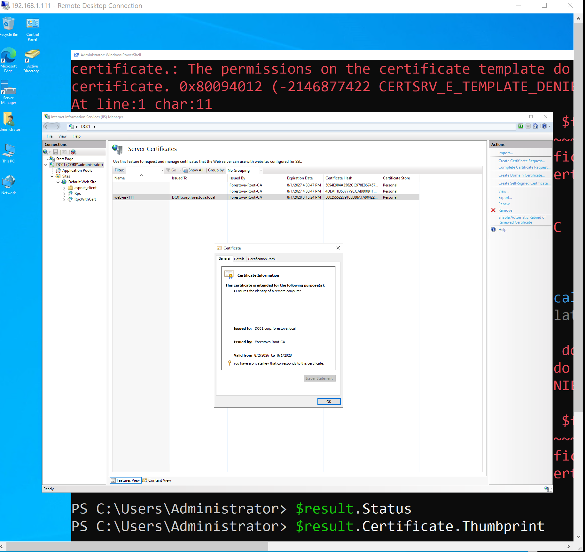
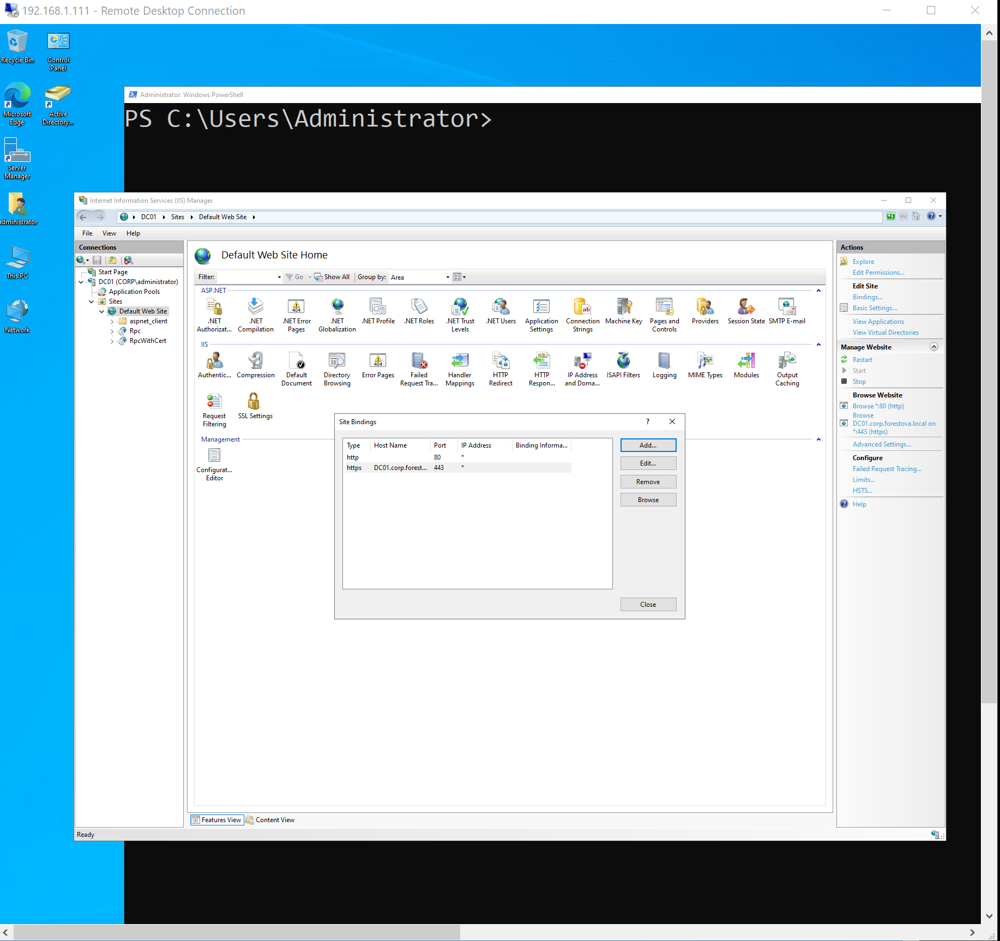
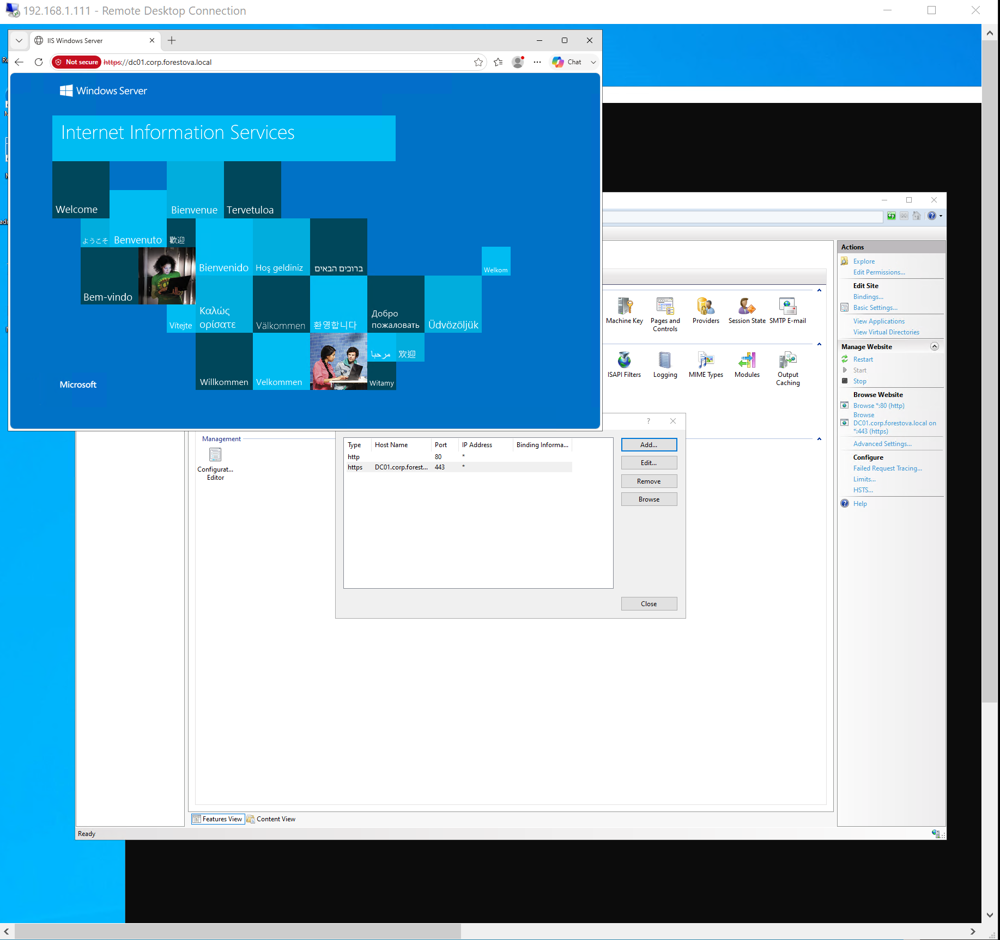
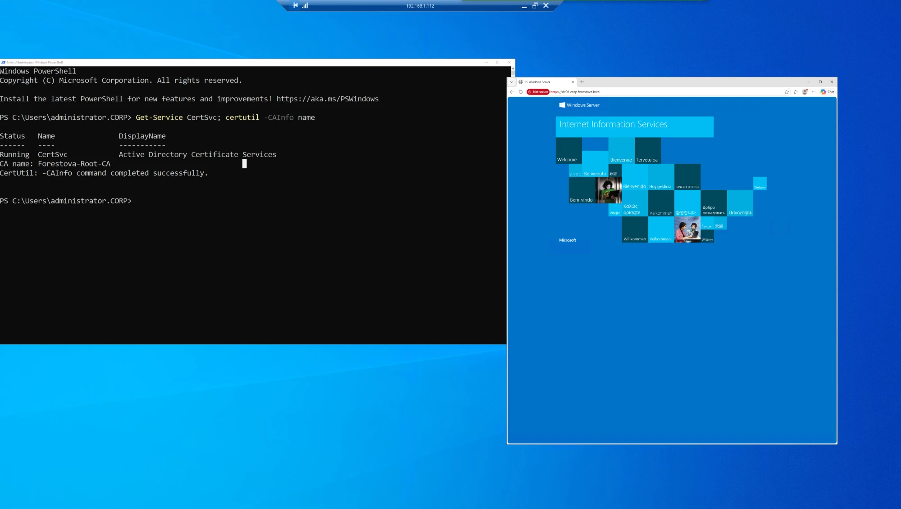
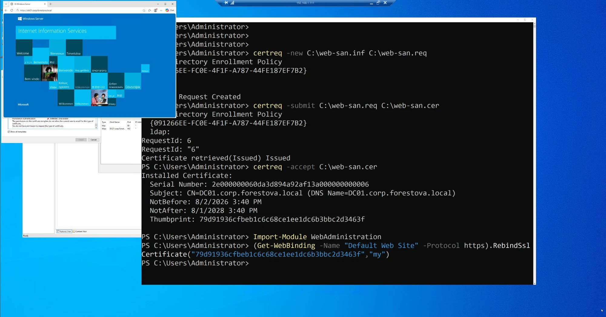

# PKI — Issuing & Hardening a TLS Certificate from an Enterprise Root CA

End-to-end certificate lifecycle on the hybrid lab: request a TLS/HTTPS certificate from an
Active Directory–integrated **Enterprise Root CA**, bind it to IIS, hit a real-world validation
failure (missing SAN), diagnose the cause (enrollment context), and fix it with `certreq`.

## Environment
- **DC01** (`192.168.1.111`) — AD DS, DNS, and IIS web host (`DC01.corp.forestova.local`)
- **CA host** (`192.168.1.112`) — AD Certificate Services, **Enterprise Root CA: `Forestova-Root-CA`**
- Domain: `corp.forestova.local`

---

## 1. Verify the CA and web host
On the CA host — confirm AD CS is running:
```powershell
Get-Service CertSvc; certutil -CAInfo name
# CA name: Forestova-Root-CA  →  CertUtil: -CAInfo command completed successfully.
```
On DC01 — confirm IIS is present:
```powershell
Get-WindowsFeature Web-Server, Web-Mgmt-Console   # both Installed
```



## 2. Issue a Web Server certificate (IIS → Create Domain Certificate)
IIS Manager → **Server Certificates → Create Domain Certificate**, CN = `DC01.corp.forestova.local`,
online CA = `Forestova-Root-CA`. The cert is issued and installed into the machine's Personal store.



> **Enrollment-context note:** the IIS wizard enrolls in the **logged-on user's** context (Domain Admin),
> which has Enroll rights on the Web Server template. A machine-context request
> (`Get-Certificate -CertStoreLocation LocalMachine`, or `certlm.msc`) is submitted as the **computer account**,
> which lacks Enroll rights → `CERTSRV_E_TEMPLATE_DENIED`. Permission is evaluated against the *requesting
> identity*, not the interactive user.

## 3. Bind to HTTPS (443)
IIS → Default Web Site → **Bindings → Add → https / 443**, host `DC01.corp.forestova.local`, select the cert.


## 4. The SAN gotcha
Browsing `https://DC01.corp.forestova.local` returns **"Not secure"** — even from another domain member
(`.112`), which proves the CA chain *is* trusted domain-wide (no "untrusted issuer" error). The issue:
IIS's Create Domain Certificate wrote only a **Common Name**, no **Subject Alternative Name**. Modern
browsers validate the hostname against the **SAN**, not the CN → name-mismatch flag.



## 5. Fix — re-issue WITH a SAN via `certreq`
`certreq` submits in the **user** context (Domain Admin ✓), and an INF lets us specify the SAN.

`web-san.inf`:
```ini
[Version]
Signature="$Windows NT$"
[NewRequest]
Subject = "CN=DC01.corp.forestova.local"
KeyLength = 2048
KeySpec = 1
KeyUsage = 0xA0
MachineKeySet = TRUE
Exportable = TRUE
ProviderName = "Microsoft RSA SChannel Cryptographic Provider"
RequestType = PKCS10
[Extensions]
2.5.29.17 = "{text}"
_continue_ = "dns=DC01.corp.forestova.local&"
[RequestAttributes]
CertificateTemplate = WebServer
```
```powershell
certreq -new C:\web-san.inf C:\web-san.req
certreq -submit C:\web-san.req C:\web-san.cer   # pick Forestova-Root-CA
certreq -accept C:\web-san.cer
# Subject: CN=DC01.corp.forestova.local (DNS Name=DC01.corp.forestova.local)  ← SAN present
```
Re-bind IIS to the new cert by thumbprint:
```powershell
Import-Module WebAdministration
(Get-WebBinding -Name "Default Web Site" -Protocol https).RebindSslCertificate("<thumbprint>","my")
```
Fresh browser tab → **green padlock, connection secure.**


---

## What this demonstrates
- AD CS Enterprise Root CA operation and TLS certificate issuance
- IIS certificate binding and HTTPS configuration
- **Enrollment context** (user vs computer identity) and certificate-template ACLs
- **SAN vs CN** validation in modern browsers — the #1 real-world certificate gotcha — and the `certreq` + INF fix
- Domain-wide trust of an Enterprise Root CA (auto-distributed to member Trusted Root stores)
